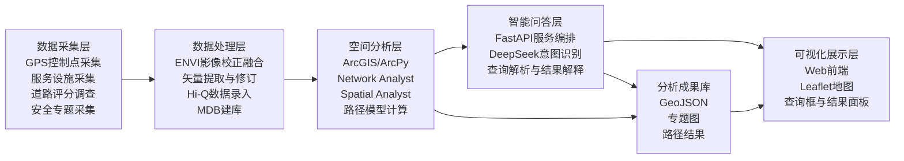
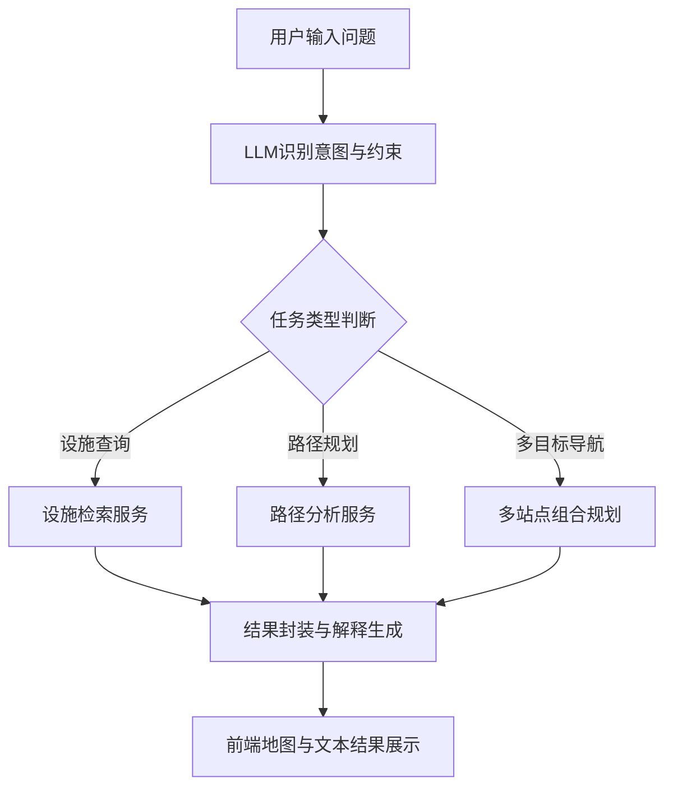
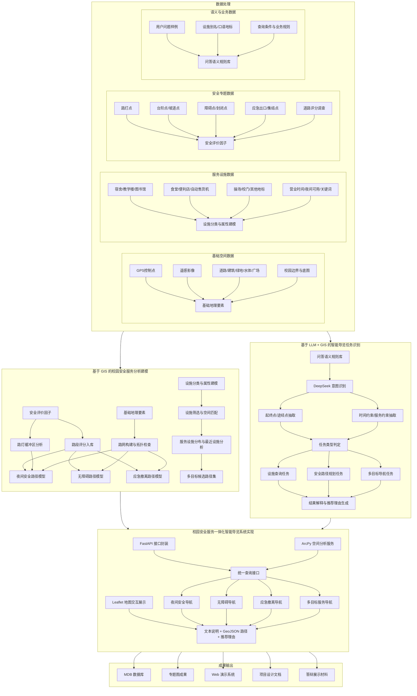
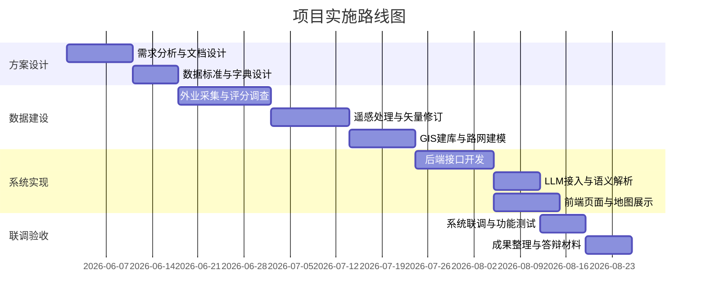

# 校园安全服务一体化智能导览系统项目设计文档

## 1. 项目概述

### 1.1 项目名称
基于 3S 集成与大语言模型的校园安全服务一体化智能导览系统

### 1.2 建设背景
现有校园地图与通用导航工具大多侧重宏观位置展示，难以支撑校园内部微尺度、场景化、安全导向的综合服务。具体表现为：

1. 难以反映夜间照明差异与夜间步行安全性。
2. 难以表达台阶、坡道、障碍物、狭窄路段等无障碍通行条件。
3. 缺少火灾、突发事件等场景下的应急撤离推荐。
4. 对食堂、便利店、自动售货机等校园生活服务支持不足。
5. 难以识别“喷泉”“人工湖”“礼堂旁边”等口语化地标表达。

本项目以校园安全导航与服务查询为核心，融合 `GPS`、`RS`、`GIS` 与 `LLM` 能力，构建支持自然语言问答、路径规划、专题分析和地图可视化的一体化导览系统。

### 1.3 建设目标
1. 建立校园基础空间数据库与服务设施数据库。
2. 建立夜间安全、无障碍、应急撤离三类路径分析模型。
3. 实现校园服务设施精细化查询与组合式导航。
4. 实现自然语言驱动的空间检索与路径规划。
5. 形成可演示系统原型、专题图成果和完整项目文档。

### 1.4 建设原则
1. 以安全优先为原则，兼顾效率与可达性。
2. 以真实校园场景为中心，强调实用性与可落地性。
3. 以统一数据标准为基础，保障后续扩展与复用。
4. 以前后端分层与服务化接口为手段，降低系统耦合度。
5. 以人工调查和智能分析结合为方法，提高结果可信度。

## 2. 需求分析

### 2.1 用户对象
1. 在校学生
2. 教师与行政人员
3. 校园访客
4. 行动不便人群
5. 校园管理与应急管理人员

### 2.2 业务需求

#### 2.2.1 安全导航需求
1. 提供夜间更安全的步行路径推荐。
2. 提供轮椅或行动不便用户的无障碍路线推荐。
3. 提供宿舍、教学楼等场景下的应急撤离路线推荐。

#### 2.2.2 服务查询需求
1. 查询最近的食堂、便利店、图书馆、校门、操场等设施。
2. 查询设施营业状态、夜间可用性和服务内容。
3. 支持食堂、便利店、多站点串联导航。

#### 2.2.3 智能问答需求
1. 支持自然语言输入。
2. 支持正式名称、编号名称和口语地标识别。
3. 支持多约束条件组合查询。

### 2.3 功能需求
1. 地图展示
2. 设施检索
3. 夜间安全路径规划
4. 无障碍路径规划
5. 应急撤离路径规划
6. 多目标路径规划
7. 智能问答与结果解释
8. 路径结果与设施结果可视化展示
9. 数据维护与专题成果输出

### 2.4 非功能需求
1. 系统应具备较好的响应速度，常规查询尽量控制在秒级。
2. 系统应保证数据结构统一，便于后期迭代维护。
3. 系统应支持 GeoJSON 等通用交换格式。
4. 系统应具备一定容错能力，能处理模糊地名与不完整表达。
5. 系统应支持教学演示、成果展示和论文答辩场景。

## 3. 总体设计

### 3.1 总体思路
系统遵循“数据采集与处理 -> 空间建模与分析 -> 智能理解与服务编排 -> 前端展示与交互”的总体思路，将 GIS 分析结果与大语言模型理解能力整合为面向校园安全服务的统一应用。

### 3.2 总体架构分层
系统采用五层架构：

1. 数据采集层
2. 数据处理层
3. 空间分析层
4. 智能问答层
5. 可视化展示层

### 3.3 系统架构图

### 3.4 业务处理流程

## 4. 技术路线设计

### 4.1 技术选型

#### 4.1.1 3S 软件
1. `GPS采集软件`
2. `ENVI`
3. `ArcGIS`
4. `Network Analyst`
5. `Spatial Analyst`

#### 4.1.2 系统开发技术
1. `Python`
2. `FastAPI`
3. `ArcPy`
4. `HTML/CSS/JavaScript`
5. `Leaflet`
6. `DeepSeek API`

#### 4.1.3 数据交换格式
1. `MDB`
2. `JSON`
3. `GeoJSON`

### 4.2 技术路线图

### 4.3 技术路线说明
1. 先完成外业与遥感数据准备，保证空间底图与专题数据齐备。
2. 再完成基础数据库、设施数据库和路网数据库建设。
3. 在统一数据结构基础上开展三类路径分析模型构建。
4. 通过 FastAPI 封装 GIS 能力，向前端和智能问答模块提供服务。
5. 由 DeepSeek 负责自然语言理解、约束提取、结果解释与交互增强。
6. 最终通过 Web 地图系统统一呈现查询结果、推荐理由和路径图层。

## 5. 数据库设计

### 5.1 数据库总体结构
数据库由基础图层、服务设施图层、安全专题图层、扩展属性表和分析结果图层组成。

### 5.2 基础图层
1. `control_points`
2. `roads`
3. `buildings`
4. `green_areas`
5. `water_areas`
6. `squares`

### 5.3 服务设施主表设计
建议统一建立 `campus_facilities` 主表。

| 字段名 | 类型 | 说明 |
| --- | --- | --- |
| `facility_id` | Text | 设施唯一编号 |
| `facility_name` | Text | 设施名称 |
| `facility_type` | Text | 设施类别 |
| `building_no` | Text | 楼栋编号或建筑编号 |
| `alias_names` | Text | 别名集合 |
| `open_time` | Text | 开放时间 |
| `close_time` | Text | 关闭时间 |
| `night_available` | Text | 夜间可用性 |
| `is_evacuation_point` | Text | 是否撤离点 |
| `remark` | Text | 备注说明 |
| `keyword_tags` | Text | 检索关键词 |

`facility_type` 建议值：

1. `dormitory`
2. `teaching_building`
3. `library`
4. `canteen`
5. `store`
6. `vending_machine`
7. `playground`
8. `gate`
9. `other`

### 5.4 扩展属性表

#### 5.4.1 食堂扩展表 `canteen_detail`
| 字段名 | 类型 | 说明 |
| --- | --- | --- |
| `canteen_id` | Text | 食堂编号 |
| `canteen_name` | Text | 食堂名称 |
| `entrance_point_id` | Text | 入口点编号 |
| `open_time` | Text | 开放时间 |
| `close_time` | Text | 关闭时间 |
| `window_list` | Text | 窗口信息 |
| `main_food_types` | Text | 主要餐食品类 |
| `night_service_flag` | Text | 是否提供夜宵 |
| `remark` | Text | 备注 |

#### 5.4.2 便利店扩展表 `store_detail`
| 字段名 | 类型 | 说明 |
| --- | --- | --- |
| `store_id` | Text | 店铺编号 |
| `store_name` | Text | 店铺名称 |
| `open_time` | Text | 开放时间 |
| `close_time` | Text | 关闭时间 |
| `goods_types` | Text | 商品类别 |
| `stationery_flag` | Text | 是否提供文具 |
| `night_service_flag` | Text | 是否夜间营业 |
| `remark` | Text | 备注 |

### 5.5 安全专题图层
1. `street_lights`
2. `stairs`
3. `ramps`
4. `barriers`
5. `narrow_segments`
6. `closed_segments`
7. `emergency_exits`
8. `assembly_points`

### 5.6 路段评分表设计
| 字段名 | 说明 |
| --- | --- |
| `road_id` | 路段编号 |
| `length_m` | 路段长度 |
| `width_score` | 宽度评分 |
| `flat_score` | 平整度评分 |
| `slope_score` | 坡度评分 |
| `light_score` | 照明评分 |
| `obstacle_score` | 障碍评分 |
| `open_score` | 开敞度评分 |
| `wheelchair_score` | 无障碍综合评分 |
| `evacuation_score` | 撤离综合评分 |
| `night_score` | 夜间安全综合评分 |
| `accessible_flag` | 是否可无障碍通行 |
| `evacuation_flag` | 是否允许作为撤离通道 |

### 5.7 分析结果图层
1. `light_buffer`
2. `night_routes`
3. `accessible_routes`
4. `evacuation_routes`
5. `service_query_results`

## 6. 业务模型设计

### 6.1 路段评分机制
采用“人工评分主导、客观辅助修正”的评价模式。

#### 6.1.1 人工评分项
1. 宽度
2. 平整度
3. 坡度友好度
4. 障碍情况
5. 开敞程度
6. 夜间安全感
7. 无障碍友好度
8. 撤离适宜度

#### 6.1.2 客观辅助项
1. 路灯缓冲区覆盖情况
2. 路段长度
3. 台阶与坡道标注
4. 封闭或禁行信息

### 6.2 夜间安全路径模型
目标是在保证可达的前提下，优先选择照明更好、障碍更少、开敞度更高的路径。

成本函数示意：

`night_cost = a * length + b * (max_score - night_score)`

### 6.3 无障碍路径模型
目标是为轮椅或行动不便用户生成更安全、可通行性更高的路线。

规则：
1. 包含不可跨越台阶的路段直接禁行。
2. 含坡道但可通行路段按无障碍评分计算成本。

成本函数示意：

`accessible_cost = a * length + b * (max_score - wheelchair_score)`

### 6.4 应急撤离模型
目标是在突发事件中快速、安全地将用户引导至操场、校门等集结点。

处理流程：
1. 先筛除封闭、严重障碍、死胡同和明显狭窄路段。
2. 再综合长度、开敞度、平整度、障碍情况与照明情况进行最优路径计算。

成本函数示意：

`evacuation_cost = a * length + b * (max_score - evacuation_score)`

### 6.5 服务查询模型
支持以下条件：
1. 设施类别
2. 营业状态
3. 夜间可用性
4. 服务内容
5. 最短距离
6. 是否作为撤离点

### 6.6 多目标导航模型
支持以下典型场景：
1. `当前位置 -> 食堂 -> 宿舍`
2. `当前位置 -> 便利店 -> 宿舍`
3. `当前位置 -> 食堂 -> 便利店 -> 宿舍`

实现流程：
1. 根据时间和服务条件筛选候选点。
2. 计算候选组合路径。
3. 输出总成本最优的串联方案。

## 7. 智能问答设计

### 7.1 可识别意图
1. `位置导航`
2. `营业状态查询`
3. `服务筛选`
4. `夜间安全路径`
5. `无障碍路径`
6. `应急撤离路径`
7. `多目标路径规划`

### 7.2 语义识别重点
1. 正式设施名识别
2. 编号类宿舍和教学楼识别
3. 口语化地点表达识别
4. 地标别名识别

### 7.3 内部任务结构
自然语言经大模型解析后，统一转为如下结构：

| 字段 | 说明 |
| --- | --- |
| `intent` | 用户意图 |
| `origin` | 起点 |
| `destination` | 终点 |
| `stops` | 中途站点 |
| `facility_type` | 设施类型 |
| `time_constraint` | 时间约束 |
| `route_mode` | 路径模式 |
| `priority_rule` | 优先规则 |

### 7.4 问答示例
示例 1：
“宿舍发生了火灾，请告诉我如何撤离到操场”

解析结果：
1. `intent = evacuation_route`
2. `destination_type = playground`

示例 2：
“我想吃夜宵，吃完再去便利店买一本笔记本，最后回一组团四栋宿舍”

解析结果：
1. `intent = multi_stop_service_route`
2. `stops = [canteen, store]`
3. `store_requirement = stationery`
4. `destination = dormitory_1_group_4`

## 8. 系统功能模块设计

### 8.1 数据管理模块
1. 基础图层导入
2. 设施图层录入
3. 专题图层录入
4. 属性表维护
5. 数据质量检查

### 8.2 GIS 分析模块
1. 路网构建
2. 路灯覆盖分析
3. 夜间安全路径分析
4. 无障碍路径分析
5. 应急撤离路径分析

### 8.3 智能服务模块
1. 自然语言意图识别
2. 设施检索服务
3. 路径规划服务
4. 多目标导航服务
5. 结果解释生成

### 8.4 前端展示模块
1. 地图底图展示
2. 图层控制
3. 查询输入框
4. 结果卡片与推荐理由展示
5. 路径高亮与设施弹窗

## 9. 接口设计

### 9.1 接口清单
1. `/query`
2. `/route-night-safe`
3. `/route-accessible`
4. `/route-evacuation`
5. `/route-multistop`
6. `/facility-search`

### 9.2 接口职责说明

#### 9.2.1 `/query`
接收自然语言问题，调用 LLM 完成意图识别、参数抽取和任务分发。

#### 9.2.2 `/route-night-safe`
返回夜间安全路径与解释说明。

#### 9.2.3 `/route-accessible`
返回无障碍路径与解释说明。

#### 9.2.4 `/route-evacuation`
返回应急撤离路径与目标点说明。

#### 9.2.5 `/route-multistop`
返回多目标串联路径与中途推荐点。

#### 9.2.6 `/facility-search`
支持设施检索、属性过滤和最近点查询。

### 9.3 统一返回结构
建议统一包含以下字段：

| 字段 | 说明 |
| --- | --- |
| `message` | 文本解释 |
| `intent` | 识别意图 |
| `data` | 查询结果或属性结果 |
| `route_geojson` | 路径结果 |
| `facility_geojson` | 设施结果 |
| `reason` | 推荐理由 |
| `status` | 处理状态 |

## 10. 部署与目录规划

### 10.1 仓库目录建议
结合当前仓库，建议按以下职责推进实现：

| 目录 | 职责 |
| --- | --- |
| `backend/` | FastAPI 接口、业务编排、GIS 服务调用 |
| `frontend/` | Web 前端、地图交互、结果展示 |
| `gis/` | ArcPy 脚本、路网分析、专题图生成 |
| `llm/` | DeepSeek 接入、提示词设计、语义解析 |
| `data/` | 原始数据、清洗数据、数据字典说明 |
| `survey/` | 问卷、访谈、评分表、采集记录 |
| `docs/` | 设计文档、会议记录、答辩材料 |
| `outputs/` | 专题图、分析成果、演示素材 |

### 10.2 部署架构建议
1. GIS 数据以 `mdb + GeoJSON` 形式作为核心数据源。
2. ArcPy 分析能力由 Python 脚本封装，并通过 FastAPI 提供服务接口。
3. 前端采用 Leaflet 加载底图、路径图层和设施图层。
4. DeepSeek API 通过后端统一代理调用，避免前端直接暴露密钥。

## 11. 实施计划

### 11.1 阶段划分
1. 需求分析阶段
2. 数据标准设计阶段
3. 外业采集阶段
4. 遥感处理阶段
5. GIS 建库与分析阶段
6. 系统开发阶段
7. 联调测试阶段
8. 成果整理阶段

### 11.2 甘特式路线说明

## 12. 测试与验收方案

### 12.1 数据验收
1. 服务设施九类数据完整。
2. 食堂与便利店扩展属性完整。
3. 地标别名、关键词和备注字段可支持语义识别。
4. 路段评分字段完整，且与空间路网正确关联。

### 12.2 分析验收
1. 可输出路灯覆盖图。
2. 可输出夜间安全路径。
3. 可输出无障碍路径。
4. 可输出应急撤离路径。
5. 可输出多目标服务导航结果。

### 12.3 系统验收示例
1. “最近的图书馆怎么走？”
2. “哪个食堂现在还开门？”
3. “最近能买到笔记本的便利店在哪？”
4. “晚上从教学楼回宿舍哪条路更安全？”
5. “宿舍发生火灾，请告诉我如何撤离到最近的操场或校门。”
6. “喷泉附近有什么可以去的地方？”

## 13. 风险与保障措施

### 13.1 数据风险
1. 外业采集遗漏
2. 属性填报不一致
3. 遥感提取误差

应对措施：
1. 制定统一采集字典和字段规范。
2. 对重点图层进行二次核验。
3. 将人工修订纳入标准流程。

### 13.2 技术风险
1. ArcPy 服务化封装复杂
2. LLM 输出结果不稳定
3. 前后端联调时数据格式不统一

应对措施：
1. 优先统一 GeoJSON 返回结构。
2. 为 LLM 增加固定任务模板和字段约束。
3. 将路径分析和设施检索拆分为独立接口，降低复杂度。

### 13.3 进度风险
1. 外业采集周期受天气影响
2. 多模块并行推进存在协作成本

应对措施：
1. 先完成最小可用版本数据采集。
2. 采用周任务清单和阶段验收机制推进。

## 14. 预期成果
1. 项目设计文档
2. 数据字典与采集规范
3. `mdb` 地理数据库
4. 校园服务设施数据库
5. 路灯覆盖图
6. 夜间安全路径图
7. 无障碍路径图
8. 应急撤离路径图
9. 校园服务设施分布图
10. Web 演示系统原型
11. 代码与技术说明文档
12. 答辩 PPT 与展示材料

## 15. 结论
本项目面向校园安全服务一体化场景，通过 3S 技术与大语言模型融合，构建覆盖“数据采集、空间分析、智能问答、地图展示”的完整技术链路。系统既能满足校园日常服务导航需求，也能支撑夜间安全与应急撤离等专题场景，具有较强的教学实践价值、展示价值和后续扩展潜力。
